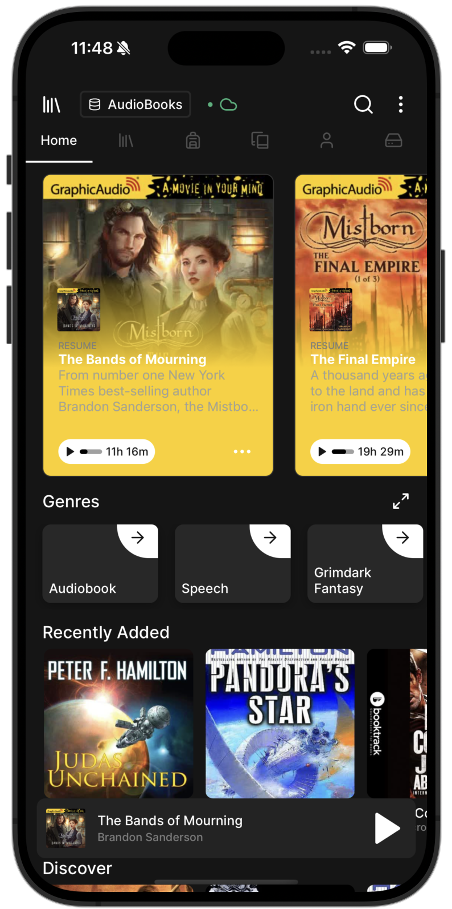

# aba
[Audiobookshelf](https://github.com/advplyr/audiobookshelf) react native client

  
  
  
  

# Info
- [foliate](https://github.com/johnfactotum/foliate-js) as ebook renderer made by [johnfactotum](https://github.com/johnfactotum)
- [tamagui](https://github.com/tamagui/tamagui) for ui components and themes
- [jotai](https://github.com/pmndrs/jotai/tree/main) as state management
- [axios](https://github.com/axios/axios) and [Tanstack Query](https://github.com/TanStack/query) for network requests

### Todo's
- [ ] Offline mode
- [ ] better playlist implementation
- [ ] better error handling for requests
    - [ ] show toast on error for all request
- [ ] **Safari 15 on iOS 15 is required for ebook reader to work**
    - [ ] get rid of private methods and properties in ebook reader javascript

### Patches
- **react-native-wagmi-charts**
    - https://github.com/coinjar/react-native-wagmi-charts/pull/151
- **react-native-webview**
    - custom webview patch that opens a UIMenuController on ios and a ActionMode on android

---
app is still under development

Safari 15 on iOS 15 is required for ebook reader to work