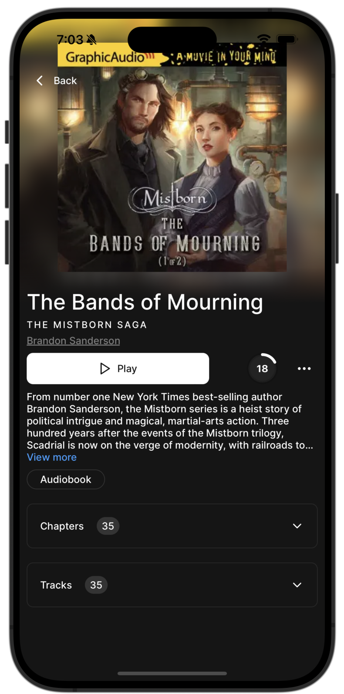
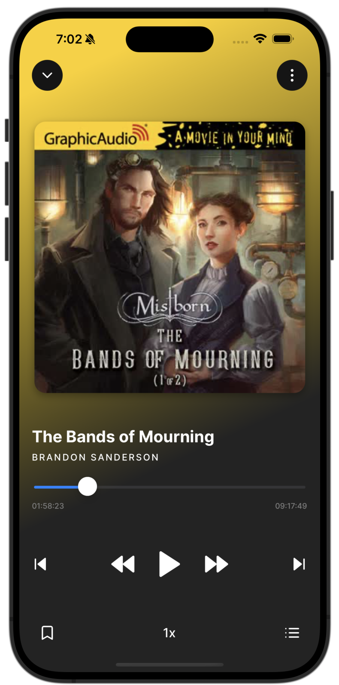
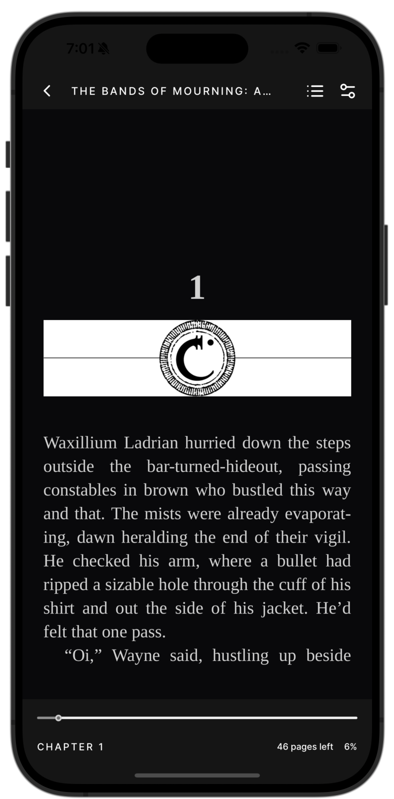

# aba
[Audiobookshelf](https://github.com/advplyr/audiobookshelf) react native client

  
  
  
  

### Patches
- **react-native-wagmi-charts**
    - https://github.com/coinjar/react-native-wagmi-charts/pull/151
- **react-native-webview**
    - custom patch that opens a UIMenuController on ios and a ActionMode on android

### Todo's
- [ ] Offline mode
- [ ] fix view jumping around on orientation change
- [ ] better android support

- [ ] fix in book reader when switching to previous chapter and then switching scroll view it goes to start of chapter

- [ ] better audioplayer
    - [ ] android: when seeking audio restarts from beginning

- [ ] better tts

- [ ] move book annotations to sql database

- [ ] better playlist implementation
    - [ ] show playlist in the audioplayer
    - [x] play one after the other
    - [ ] movable playlist rows

- [ ] fix unnecessary rerenders when we get a user update from the socket

- [ ] better error handleing for requests
    - [ ] show toast on error for all request

